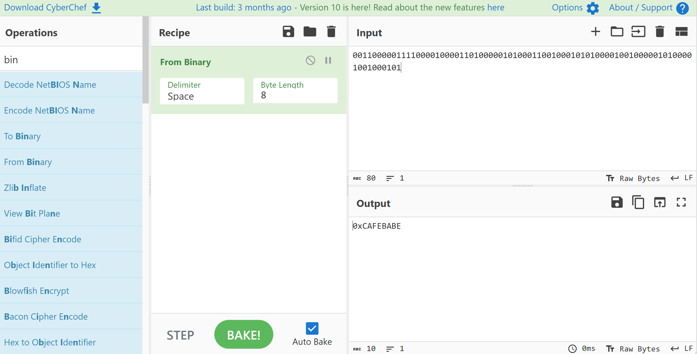
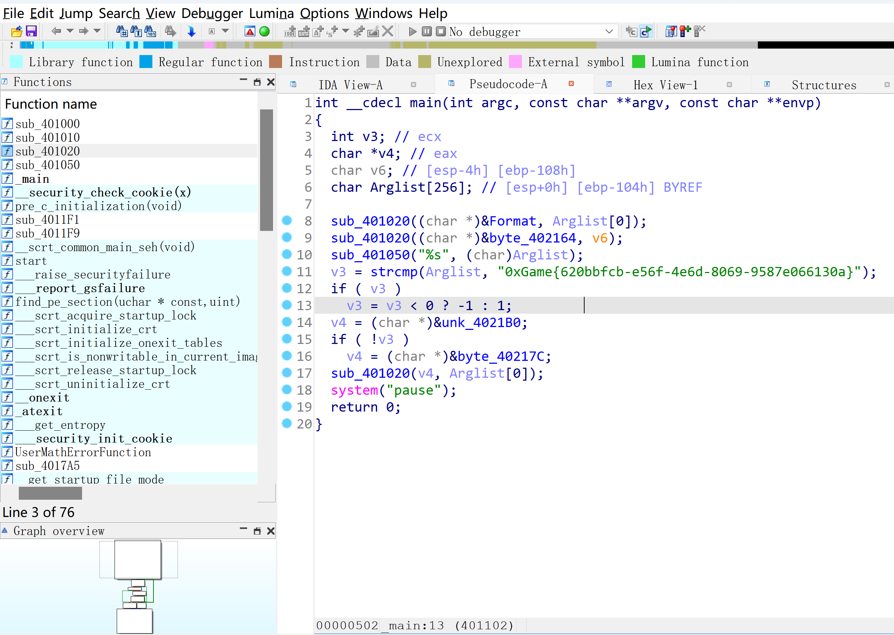
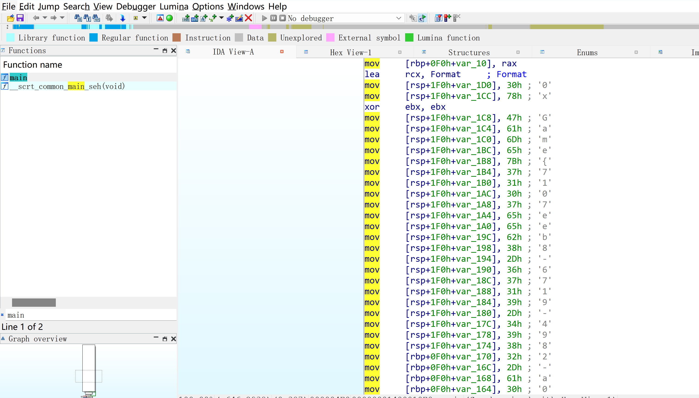
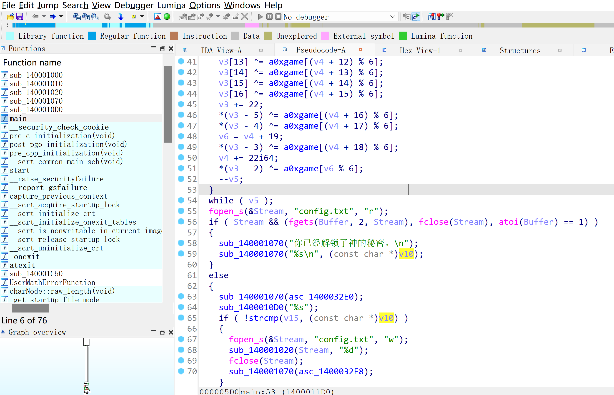
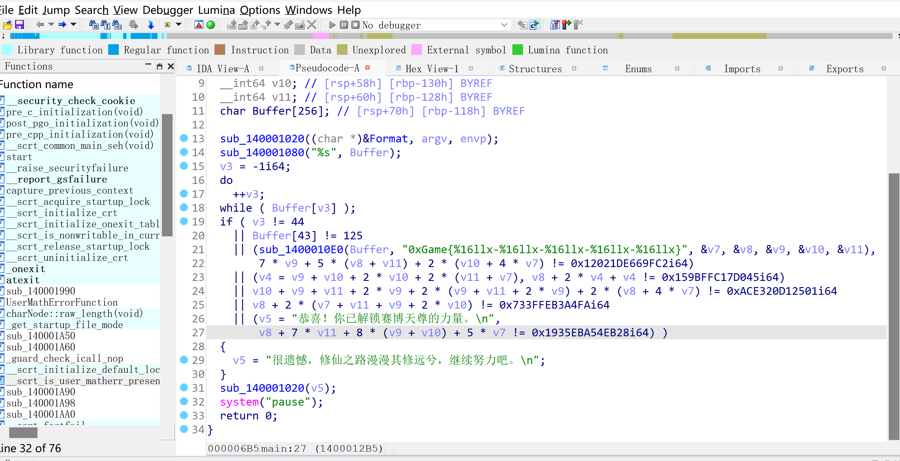

# Reverse

## 数字筑基

根据程序要求，我们需要将如下内容转换为其十六进制形式。这里用到这个工具

[在线工具](https://gchq.github.io/CyberChef/) 

~~可能你需要能访问谷歌才可以打开这个工具~~。



利用该工具拿到十六进制的字符串，输入程序，即可拿到flag。(题目描述的16进制形式可能存在歧义。最终输入应该是ASCII字符串(如30=='0'))

## 代码金丹

拿到程序后，我们可以用IDA打开，F5反编译main函数后，可以看到如下内容



由此，得到flag

## 网络元婴

拿到程序后，仿照第三题用IDA打开，F5反编译main函数后，可以看到如下内容。



由此，可以将每一位拼接，从而获得flag，也可以动态调试，复制最终拼接好的flag。

## 虚拟化神

拿到程序，运行发现是重启验证(输入注册码后不直接解锁功能，需要下次启动软件才会生效)。

观察可以发现，程序在验证完毕、重启之前会在同目录下创建config.txt。

根据其内容发现输入错误为0(false)，将其改为1(true)，再次运行程序，即可获得flag。



当然，我们IDA分析一下也能发现，程序会解密出内置的flag，然后和输入进行比较，所以动态调试也可以拿到flag。

## 赛博天尊

拿到程序，丢入IDA分析，可以看到如下结果



可以发现输入的flag按-分割，转换成整数后需要满足特定方程，提取出方程后求解即可。

```python
from sympy import symbols, Eq, solve

v7, v8, v9, v10, v11 = symbols('v7 v8 v9 v10 v11')

equations = [
    Eq(7 * v9 + 5 * (v8 + v11) + 2 * (v10 + 4 * v7), 0x12021DE669FC2),
    Eq(v9 + v10 + 2 * v10 + 2 * (v11 + v7) + v8, 0x159BFFC17D045 -
       2 * (v9 + v10 + 2 * v10 + 2 * (v11 + v7))),
    Eq(v10 + v9 + v11 + 2 * v9 + 2 * (v9 + v11 + 2 * v9) +
       2 * (v8 + 4 * v7), 0xACE320D12501),
    Eq(v8 + 2 * (v7 + v11 + v9 + 2 * v10), 0x733FFEB3A4FA),
    Eq(v8 + 7 * v11 + 8 * (v9 + v10) + 5 * v7, 0x1935EBA54EB28)
]

solutions = solve(equations)

sorted_solutions = {k: hex(v) for k, v in sorted(
    solutions.items(), key=lambda item: int(str(item[0])[1:]))}

formatted_sorted_hex_solution = f"0xGame{{{'-'.join([val[2:] for val in sorted_solutions.values()])}}}"

print(formatted_sorted_hex_solution)

```

运行如上脚本即可得到flag。