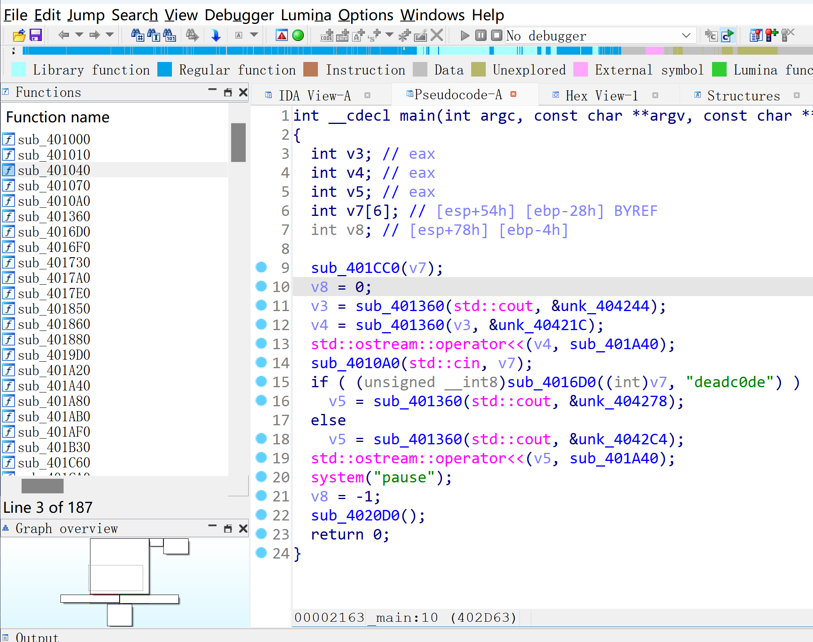
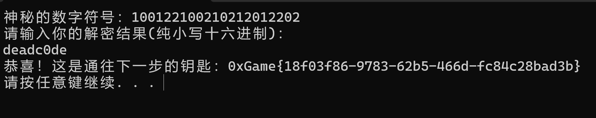
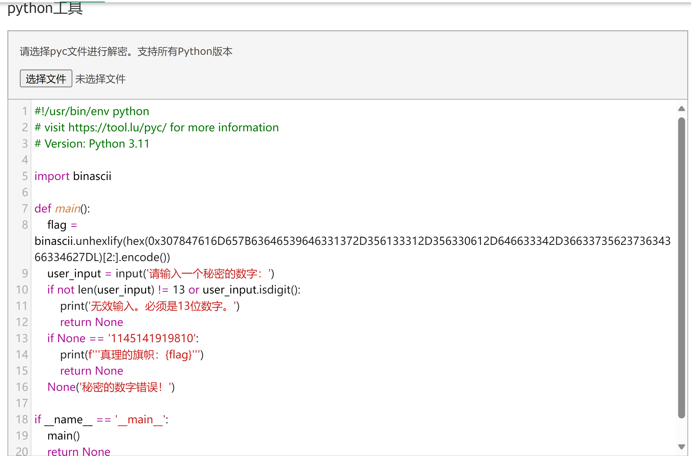
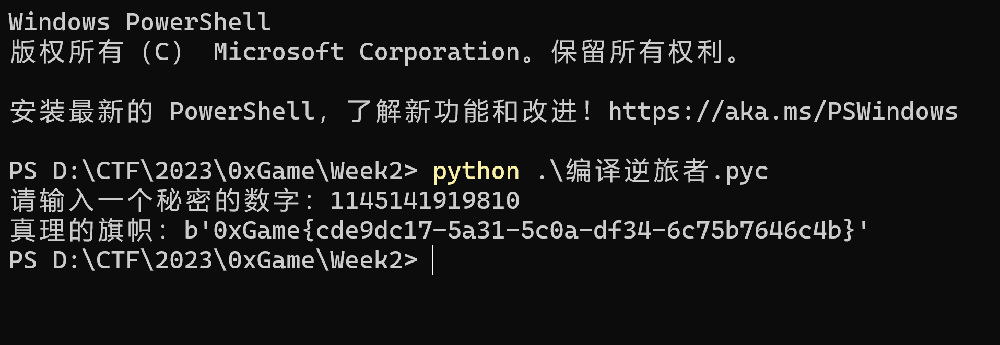
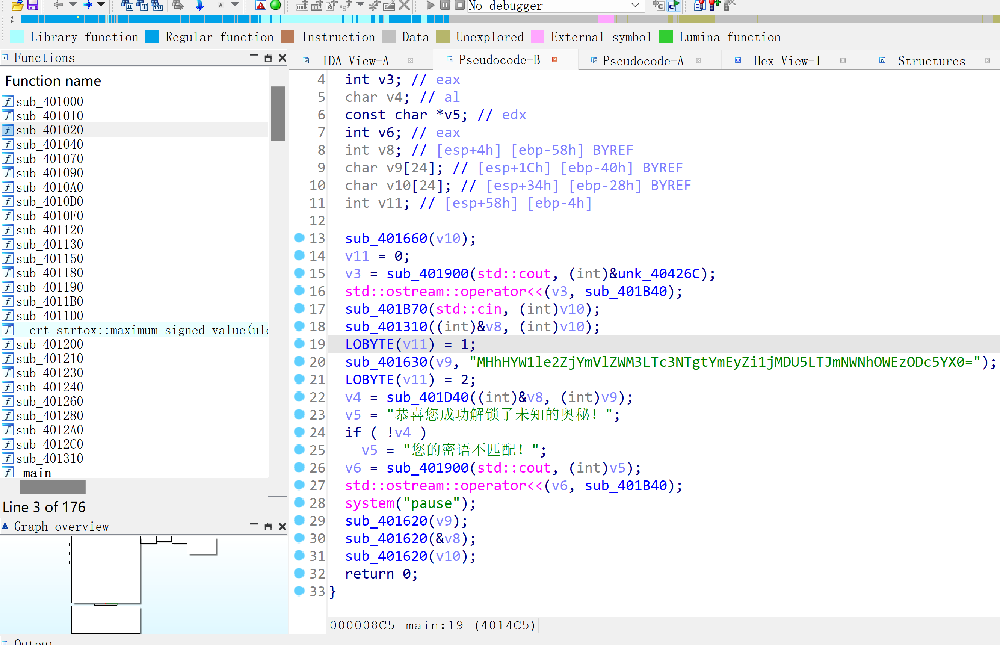
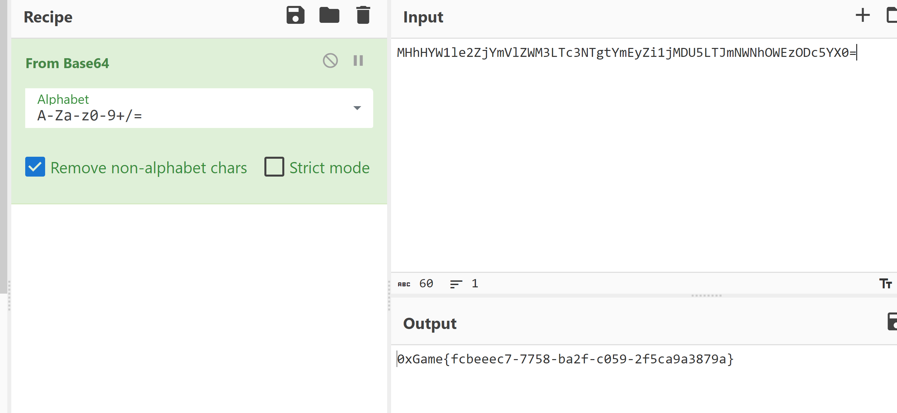
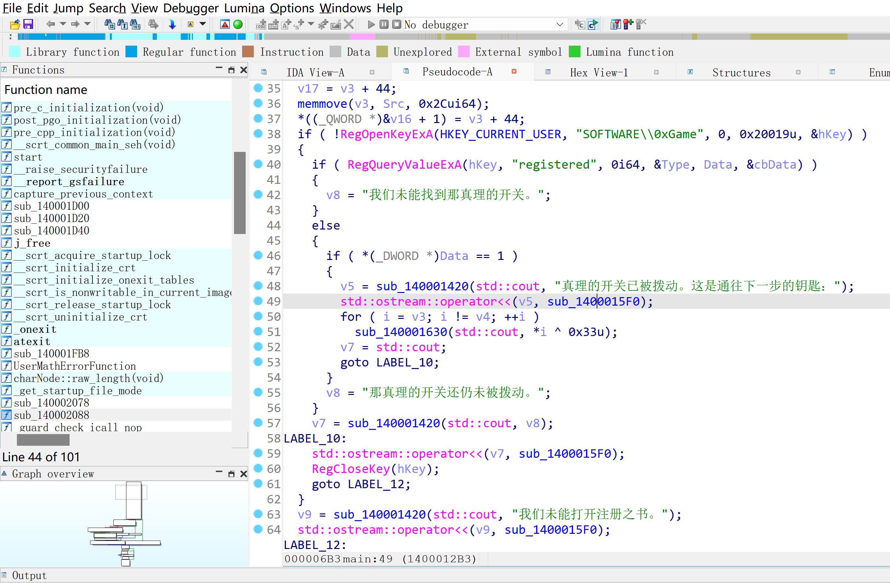
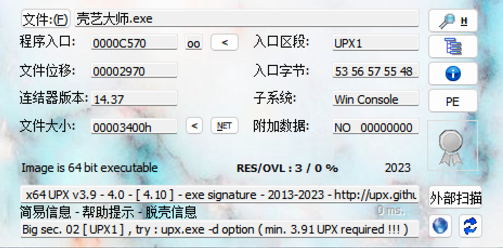
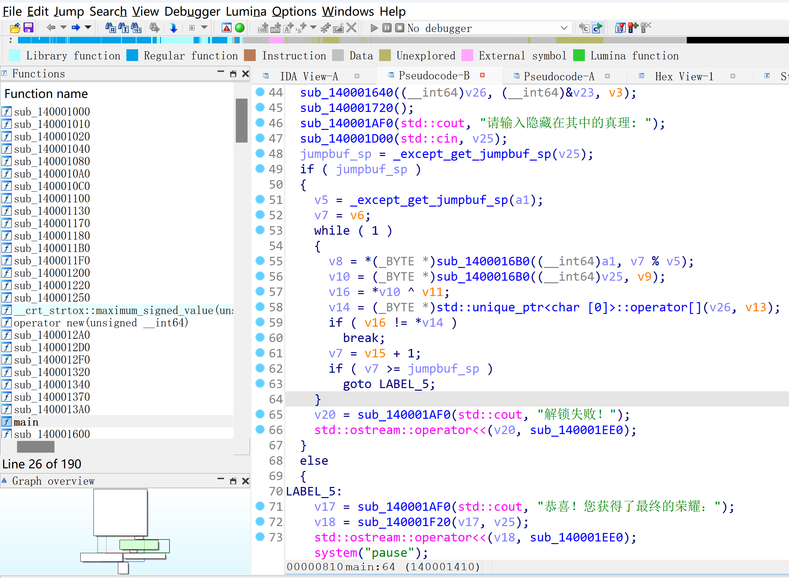
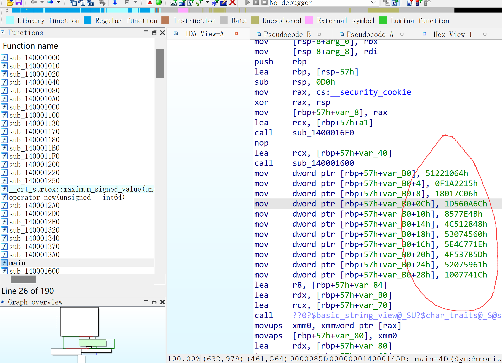

# Reverse

## 符文解密师

拿到程序，利用IDA打开后，F5反编译*main*函数，可以看到如下内容。

根据逻辑，可以看出我们需要输入的内容是*deadc0de*，输入后即可得到*flag*

## 编译逆旅者

解压发现是个pyc文件，我们使用在线反编译工具处理(比较方便)

[在线工具](https://tool.lu/pyc/) 

根据反编译结果，我们得知python版本以及需要输入的值。直接运行pyc文件输入即可得到*flag*。

## 码海舵师

拿到程序后，依然是用IDA打开，F5反编译*main*函数后，可以看到如下内容。

稍微分析一下可以看出，这里*sub_401310*为base64编码函数，当然，看到程序内这种带*\=\*的字符串，我们也可以直接猜测是base64编码。进行BASE64解码后即可得到*flag*。

## 注册侦探

拿到程序，IDA打开后，F5反编译*main*函数，可以看到如下内容。

可以知道程序在检测注册表项的值

> HKEY_CURRENT_USER\Software\0xGame\registered

是否为1，如果为1则输出*flag*。这里我们直接创建这个注册表值并将其修改为1即可得到*flag*。

## 壳艺大师

拿到程序，丢入IDA分析，发现报错，查下壳。

可以发现是UPX壳，使用**upx -d**命令脱壳后，再次丢入IDA分析，可以看到如下内容。

其中的*a1*的值可以在*sub_1400016E0*函数中看到，为*The0xGameKey*

如下是内置的数据

算法核心可以看出是对输入的字符串用*The0xGameKey*进行异或运算，然后与内置的数据按byte比较，这里我们将内置的数据与*The0xGameKey*进行异或运算，即可得到*flag*。
