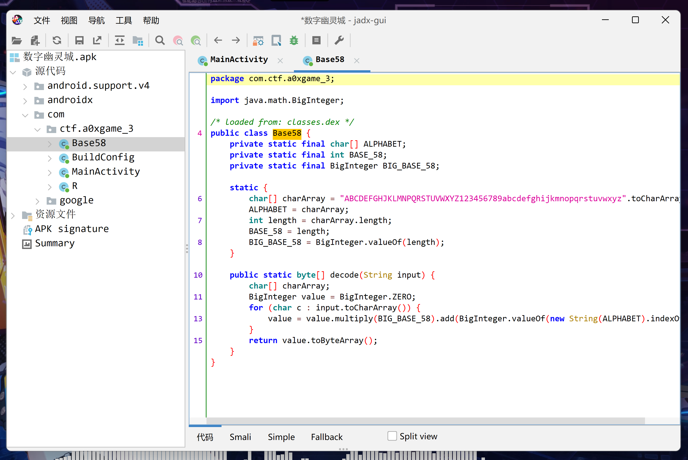

# Reverse

本周的Reverse挑战全是关于**Java**或**Android**(不含SO)题型，为了解决这些问题，我们将使用 [JADX](https://github.com/skylot/jadx/releases) 工具来进行反编译和分析。


## 代码启示录

首先，我们得到题目后，将 jar 文件拖入到 JADX 中，以便分析其内部逻辑。


通过反编译 **Main** 类，我们可以清晰地看到程序的逻辑以及隐藏的 **flag**。

## 旋转密码城

与上面类似，我们将 jar 文件拖入到 JADX 中，并开始分析其代码逻辑。


在 **Main** 类中，我们发现程序会将用户输入通过 **CaesarPlus** 函数处理后与内置值进行比较。而 **CaesarPlus** 函数实质上是在 ASCII 表的可打印范围内，对输入字符右移47位，也就是常说的 **ROT47** 算法。我们可以使用 [CyberChef](https://gchq.github.io/CyberChef/) 工具来解密内置值，得到 **flag**。


## 数字幽灵城

在本题中，我们将 apk 文件拖入到 JADX 中进行分析。


反编译 **MainActivity** 类后，我们发现程序会从资源中获取编码后的 **flag**，然后进行 **BASE58** 解码，并将解码结果利用 **SharedPreferences** 进行存储。之后，程序会将用户的输入与已存储的 **flag** 进行比较。

继续分析 **Base58** 类，我们可以更好地理解 **BASE58** 的解码逻辑。



在找到资源中 **encodedFlag** 的值后，


我们可以使用 **BASE58** 的码表和程序内储存的 **encodedFlag**，进行 **BASE58** 解码，以获取 **flag**。


## 变量迷城

在这道题目中，我们同样将 jar 文件拖入到 JADX 中，准备进行分析。


反编译 **Main** 类后，我们可以看到程序的逻辑，它会读取环境变量 **x** 和 **y**，以及属性 **brand**。要求 **brand** 等于 **0xGame**，并且 **x** 和 **y** 需要满足以下方程组：

\[x^2 + 2y^2 + 3x + 4y = 7384462351178\]

\[5x^2 + 6y^2 + 7x + 8y = 22179606057658\]

我们可以编写一个 **python** 脚本来解决这个方程组。

```python
from sympy import symbols, Eq, solve

x, y = symbols('x y')

eq1 = Eq(x**2 + 2*y**2 + 3*x + 4*y, 7384462351178)

eq2 = Eq(5*x**2 + 6*y**2 + 7*x + 8*y, 22179606057658)

solutions = solve((eq1, eq2), (x, y))
print(solutions)
```

运行结果如下：

```text
[(114514, 1919810), (1842839172187 - 14742706156291/(6*(-1/2 - sqrt(3)*I/2)*(56606436278068528864/27 + 5*sqrt(92742209415608125067643)*I/9)**(1/3)) - (-1919816/3 + (-1/2 - sqrt(3)*I/2)*(56606436278068528864/27 + 5*sqrt(92742209415608125067643)*I/9)**(1/3) + 14742706156291/(9*(-1/2 - sqrt(3)*I/2)*(56606436278068528864/27 + 5*sqrt(92742209415608125067643)*I/9)**(1/3)))**2/2 - 3*(-1/2 - sqrt(3)*I/2)*(56606436278068528864/27 + 5*sqrt(92742209415608125067643)*I/9)**(1/3)/2, -1919816/3 + (-1/2 - sqrt(3)*I/2)*(56606436278068528864/27 + 5*sqrt(92742209415608125067643)*I/9)**(1/3) + 14742706156291/(9*(-1/2 - sqrt(3)*I/2)*(56606436278068528864/27 + 5*sqrt(92742209415608125067643)*I/9)**(1/3))), (1842839172187 - 3*(-1/2 + sqrt(3)*I/2)*(56606436278068528864/27 + 5*sqrt(92742209415608125067643)*I/9)**(1/3)/2 - (-1919816/3 + 14742706156291/(9*(-1/2 + sqrt(3)*I/2)*(56606436278068528864/27 + 5*sqrt(92742209415608125067643)*I/9)**(1/3)) + (-1/2 + sqrt(3)*I/2)*(56606436278068528864/27 + 5*sqrt(92742209415608125067643)*I/9)**(1/3))**2/2 - 14742706156291/(6*(-1/2 + sqrt(3)*I/2)*(56606436278068528864/27 + 5*sqrt(92742209415608125067643)*I/9)**(1/3)), -1919816/3 + 14742706156291/(9*(-1/2 + sqrt(3)*I/2)*(56606436278068528864/27 + 5*sqrt(92742209415608125067643)*I/9)**(1/3)) + (-1/2 + sqrt(3)*I/2)*(56606436278068528864/27 + 5*sqrt(92742209415608125067643)*I/9)**(1/3)), (1842839172187 - 3*(56606436278068528864/27 + 5*sqrt(92742209415608125067643)*I/9)**(1/3)/2 - (-1919816/3 + 14742706156291/(9*(56606436278068528864/27 + 5*sqrt(92742209415608125067643)*I/9)**(1/3)) + (56606436278068528864/27 + 5*sqrt(92742209415608125067643)*I/9)**(1/3))**2/2 - 14742706156291/(6*(56606436278068528864/27 + 5*sqrt(92742209415608125067643)*I/9)**(1/3)), -1919816/3 + 14742706156291/(9*(56606436278068528864/27 + 5*sqrt(92742209415608125067643)*I/9)**(1/3)) + (56606436278068528864/27 + 5*sqrt(92742209415608125067643)*I/9)**(1/3))]
```

其中第一个解为有效解。我们执行以下命令，即可获取 **flag**：

```shell
set x=114514&&set y=1919810&&java -Dbrand=0xGame -jar .\变量迷城.jar
```


## 虚构核心

最后一道题，我们将 apk 文件拖入到 JADX 中，开始进行分析。


反编译 **MainActivity** 类后，我们发现程序的逻辑如下：

- **checkFlag** 函数会解密资源中的 **dex** 文件，动态加载后调用其中的 **boolean com.ctf.a0xgame_5.FlagChecker.checkFlag(String input)** 函数，根据其返回值判断 **flag** 是否正确。

- **decrypt** 函数会根据 **key**，利用 **xor** 解密 **dex** 文件。

我们可以手动解密 **dex** 文件或直接复制出解密完成的 **dex** 文件。

在我们获取到解密的 **dex** 文件后，对其进行反编译，观察其内部逻辑。


我们可以发现 **flag** 的开始和结束部分已知，但中间三个文本的 **md5** 值需与特定 **MD5** 值匹配。由于已知：

1. **flag** 格式固定
2. 三个 **md5** 值分别对应三段 **4** 个字符的十六进制文本。

我们可以选择暴力破解或查询 **MD5** 值对应的文本，以得到完整的 **flag**。以下网站会有所帮助：

[cmd5](https://www.cmd5.org/)