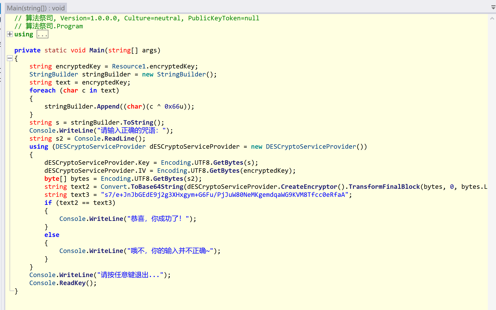

# Reverse

## 二进制学徒

首先，我们得到题目后，利用 [在线工具](https://tool.lu/pyc/) 进行反编译


通过反编译，我们可以清晰地看到程序的逻辑以及隐藏的 **flag**。

## 代码悟道者

这道题，我们将 jar 文件拖入到 JADX 中。


在 **Main** 类中，我们发现程序会将用户输入通过 **customBase64Encode** 函数处理后与内置值进行比较。而 **customBase64Encode** 函数是一个自定义编码表的 **BASE64** 算法。我们可以使用 [CyberChef](https://gchq.github.io/CyberChef/) 工具来解密内置值，得到 **flag**。


## 指令神使

在本题中，我们将 exe 文件拖入到 IDA 中进行分析。


根据反编译结果，我们可以发现程序会将输入进行一系列判断，然后与内置的Str2比较。这里 **sub_140001154** 函数负责判断输入是否符合 **0xGame{}** 格式。**sub_140001118** 函数反编译结果如下。


可以看出该函数是对Str1中的所有小写字母右移13位，既 **ROT13** 算法。我们可以使用 [CyberChef](https://gchq.github.io/CyberChef/) 工具来解密内置值，得到 **flag**。


## 内存星旅者

在这道题目中，我们同样将 exe 文件拖入到 IDA 中，准备进行分析。


反编译 **main** 函数后，我们可以看到程序的逻辑，**sub_140001510** 函数接收程序启动参数，并修改 **v5** 变量，该函数如果返回 **true** 则传入 **v5** 变量调用 **sub_140001600** 函数，之后提示

> **恭喜，flag已生成，你能找到并读取它吗？** 

这里对 **sub_140001600** 函数进行分析


可以看出，该函数会利用 **GetTempPathA** 获取临时文件目录，之后**sub_140001600** 函数会对内置的值利用 **v5** 变量进行 xor 操作，之后会调用 **DeleteFileA** 删除文件。这里做一些分析后可以看出，是将解密后的 **flag** 利用 **std::ofstream** 写出到临时文件目录的 **flag** 文件中，随后删除该文件。

之后我们对 **sub_140001510** 函数进行分析，可以得出 **v5** 变量的值应该是 **1897488**，利用该信息，我们就可以解密出正确的 **flag**。


不过这里若是进行详细的分析，可以知道程序需要 **-0xGame** 参数以及 **-Portal=** 参数。

我们这里只要执行如下命令，并且阻止临时文件目录的 **flag** 文件被删除，即可拿到 **flag**。

```shell
内存星旅者.exe -0xGame -Portal=1897488
```

## 算法祭司

最后一道题，我们将 exe 文件拖入到 ILSpy 中，开始进行分析。



可以看出，程序从资源中拿到 **encryptedKey** 然后对其 **xor 0x66**，之后将其分别作为 **DES** 算法的 **IV** 和 **KEY** ，将用户的输入加密后进行 **BASE64** 编码，之后与内置值进行比较。

这里我们可以使用 [CyberChef](https://gchq.github.io/CyberChef/) 工具来解密内置值，得到 **flag**。


